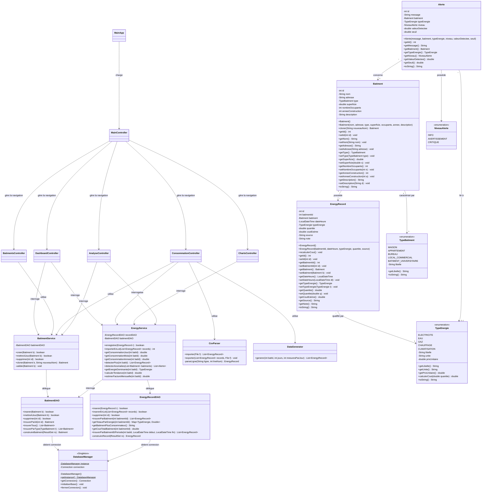

## Diagramme de Classes UML 

```mermaid
classDiagram
    %% Relations de dépendance et d'association
    MainApp --> MainController : charge
    MainController --> DashboardController : gère la navigation
    MainController --> BatimentsController : gère la navigation
    MainController --> ConsommationController : gère la navigation
    MainController --> ChartsController : gère la navigation
    MainController --> AnalyseController : gère la navigation

    DashboardController --> EnergyService : interroge
    DashboardController --> BatimentService : interroge
    BatimentsController --> BatimentService : utilise
    ConsommationController --> EnergyService : utilise
    ConsommationController --> BatimentService : utilise
    ConsommationController --> CsvParser : utilise
    ConsommationController --> DataGenerator : utilise
    ChartsController --> EnergyService : interroge
    AnalyseController --> EnergyService : interroge
    AnalyseController --> BatimentService : interroge

    BatimentService --> BatimentDAO : délègue
    EnergyService --> EnergyRecordDAO : délègue
    EnergyService --> BatimentDAO : interroge

    BatimentDAO --> DatabaseManager : obtient connexion
    EnergyRecordDAO --> DatabaseManager : obtient connexion

    %% Modèles et associations de données
    Batiment "1" --> "*" EnergyRecord : possède
    EnergyRecord "*" --> "1" TypeEnergie : qualifié par
    Batiment "1" --> "1" TypeBatiment : caractérisé par
    Alerte "*" --> "1" Batiment : concerne
    Alerte "*" --> "0..1" TypeEnergie : lié à
    Alerte --> NiveauAlerte : possède

    class Batiment {
        -int id
        -String nom
        -String adresse
        -TypeBatiment type
        -double superficie
        -int nombreOccupants
        -int anneeConstruction
        -String description
        +Batiment()
        +Batiment(nom, adresse, type, superficie, occupants, annee, description)
        +cloner(String nouveauNom) Batiment
        +getId() int
        +setId(int id) void
        +getNom() String
        +setNom(String nom) void
        +getAdresse() String
        +setAdresse(String adresse) void
        +getType() TypeBatiment
        +setType(TypeBatiment type) void
        +getSuperficie() double
        +setSuperficie(double s) void
        +getNombreOccupants() int
        +setNombreOccupants(int n) void
        +getAnneeConstruction() int
        +setAnneeConstruction(int a) void
        +getDescription() String
        +setDescription(String d) void
        +toString() String
    }

    class EnergyRecord {
        -int id
        -int batimentId
        -Batiment batiment
        -LocalDateTime dateHeure
        -TypeEnergie typeEnergie
        -double quantite
        -double coutEstime
        -String source
        -String note
        +EnergyRecord()
        +EnergyRecord(batimentId, dateHeure, typeEnergie, quantite, source)
        +recalculerCout() void
        +getId() int
        +setId(int id) void
        +getBatimentId() int
        +setBatimentId(int id) void
        +getBatiment() Batiment
        +setBatiment(Batiment b) void
        +getDateHeure() LocalDateTime
        +setDateHeure(LocalDateTime dt) void
        +getTypeEnergie() TypeEnergie
        +setTypeEnergie(TypeEnergie t) void
        +getQuantite() double
        +setQuantite(double q) void
        +getCoutEstime() double
        +getSource() String
        +getNote() String
        +toString() String
    }

    class Alerte {
        -int id
        -String message
        -Batiment batiment
        -TypeEnergie typeEnergie
        -NiveauAlerte niveau
        -double valeurDetectee
        -double seuil
        +Alerte(message, batiment, typeEnergie, niveau, valeurDetectee, seuil)
        +getId() int
        +getMessage() String
        +getBatiment() Batiment
        +getTypeEnergie() TypeEnergie
        +getNiveau() NiveauAlerte
        +getValeurDetectee() double
        +getSeuil() double
        +toString() String
    }

    class NiveauAlerte {
        <<enumeration>>
        INFO
        AVERTISSEMENT
        CRITIQUE
    }

    class TypeBatiment {
        <<enumeration>>
        MAISON
        APPARTEMENT
        BUREAU
        LOCAL_COMMERCIAL
        BATIMENT_UNIVERSITAIRE
        -String libelle
        +getLibelle() String
        +toString() String
    }

    class TypeEnergie {
        <<enumeration>>
        ELECTRICITE
        EAU
        GAZ
        CHAUFFAGE
        CLIMATISATION
        -String libelle
        -String unite
        -double prixUnitaire
        +getLibelle() String
        +getUnite() String
        +getPrixUnitaire() double
        +calculerCout(double quantite) double
        +toString() String
    }

    class DatabaseManager {
        <<Singleton>>
        -DatabaseManager instance$
        -Connection connection
        -DatabaseManager()
        +getInstance()$ DatabaseManager
        +getConnexion() Connection
        +initialiserBase() void
        +fermerConnexion() void
    }

    class BatimentDAO {
        +inserer(Batiment b) boolean
        +mettreAJour(Batiment b) boolean
        +supprimer(int id) boolean
        +trouverParId(int id) Batiment
        +trouverTous() List~Batiment~
        +trouverParType(TypeBatiment t) List~Batiment~
        -construireBatiment(ResultSet rs) Batiment
    }

    class EnergyRecordDAO {
        +inserer(EnergyRecord r) boolean
        +insererEnLot(List~EnergyRecord~ records) boolean
        +supprimer(int id) boolean
        +trouverParBatiment(int batimentId) List~EnergyRecord~
        +getTotauxParEnergie(int batimentId) Map~TypeEnergie, Double~
        +getBatimentPlusConsommateur() String
        +getCoutTotalBatiment(int batimentId) double
        +trouverParBatimentEtPeriode(int batId, LocalDateTime debut, LocalDateTime fin) List~EnergyRecord~
        -construireRecord(ResultSet rs) EnergyRecord
    }

    class BatimentService {
        -BatimentDAO batimentDAO
        +creer(Batiment b) boolean
        +mettreAJour(Batiment b) boolean
        +supprimer(int id) boolean
        +cloner(Batiment b, String nouveauNom) Batiment
        -valider(Batiment b) void
    }

    class EnergyService {
        -EnergyRecordDAO recordDAO
        -BatimentDAO batimentDAO
        +enregistrer(EnergyRecord r) boolean
        +importerEnLot(List~EnergyRecord~ records) int
        +getConsommationJour(int batId) double
        +getConsommationMois(int batId) double
        +getConsommationAnnee(int batId) double
        +detecterPics(int batId) List~EnergyRecord~
        +detecterAnomalies(List~Batiment~ batiments) List~Alerte~
        +getEnergieDominante(int batId) TypeEnergie
        +calculerTendance(int batId) double
        +estimerFactureMensuelle(int batId) double
    }

    class CsvParser {
        +importer(File f) List~EnergyRecord~
        +exporter(List~EnergyRecord~ records, File f) void
        -parseLigne(String ligne, int lineNum) EnergyRecord
    }

    class DataGenerator {
        +generer(int batId, int jours, int mesuresParJour) List~EnergyRecord~
    }
```

